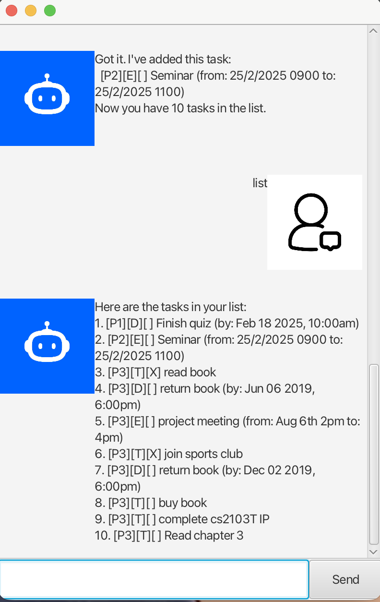

# Zane User Guide

Zane is a desktop task manager that helps you track todos, deadlines, and events. Keep your tasks organised with priorities and mark them done as you go.



---

## Quick Start

1. Run the application from the project folder.
2. Type a command and press Enter.
3. All tasks are saved automatically to `data/zane.txt`.

---

## Adding a Todo

Add a simple task with no due date.

Format: `todo <description> (/p <priority>)`

- **Priority** (optional): 1 (high), 2 (medium), or 3 (low). Default is 3 if omitted.

Example:

```
todo Buy groceries
todo Read chapter 3 /p 1
```

```
Got it. I've added this task:
  [P3][T][ ] Buy groceries
Now you have 1 tasks in the list.
```

---

## Adding a Deadline

Add a task with a due date and time.

Format: `deadline <description> /by <date> (/p <priority>)`

- **Date format**: `d/M/yyyy HHmm` (e.g. `16/2/2025 1430` for 16 Feb 2025, 2:30 PM)
- **Priority** (optional): 1, 2, or 3. Default is 3.

Example:

```
deadline Submit report /by 20/2/2025 2359
deadline Finish quiz /by 18/2/2025 1000 /p 1
```

```
Got it. I've added this task:
  [P1][D][ ] Finish quiz (by: Feb 18 2025, 10:00AM)
Now you have 2 tasks in the list.
```

---

## Adding an Event

Add a task with a start and end time.

Format: `event <description> /from <start> /to <end> (/p <priority>)`

- **Priority** (optional): 1, 2, or 3. Default is 3.

Example:

```
event Team meeting /from 2pm /to 3pm
event Seminar /from 25/2/2025 0900 /to 25/2/2025 1100 /p 2
```

```
Got it. I've added this task:
  [P2][E][ ] Seminar (from: 25/2/2025 0900 to: 25/2/2025 1100)
Now you have 3 tasks in the list.
```

---

## Listing Tasks

View all tasks in your list.

Format: `list`

```
Here are the tasks in your list:
1. [P3][T][ ] Buy groceries
2. [P1][D][ ] Finish quiz (by: Feb 18 2025, 10:00AM)
3. [P2][E][ ] Seminar (from: 25/2/2025 0900 to: 25/2/2025 1100)
```

---

## Marking Tasks

Mark a task as done or not done by its index (from the list).

- Mark as done: `mark <index>`
- Mark as not done: `unmark <index>`

Example:

```
mark 1
unmark 2
```

---

## Deleting Tasks

Remove a task by its index.

Format: `delete <index>`

Example:

```
delete 2
```

```
Noted. I've removed this task:
  [P1][D][ ] Finish quiz (by: Feb 18 2025, 10:00AM)
Now you have 2 tasks in the list.
```

---

## Exiting

Exit the application.

Format: `bye`

```
Bye. Hope to see you again soon!
```

---

## Command Summary

| Command | Format |
|---------|--------|
| Todo | `todo <description> [/p 1\|2\|3]` |
| Deadline | `deadline <description> /by <date> [/p 1\|2\|3]` |
| Event | `event <description> /from <start> /to <end> [/p 1\|2\|3]` |
| List | `list` |
| Mark | `mark <index>` |
| Unmark | `unmark <index>` |
| Delete | `delete <index>` |
| Exit | `bye` |
